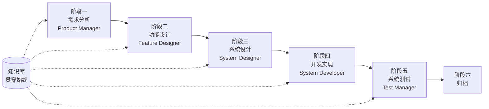

# SpecCrew 快速开始指南

本文档帮助您快速了解如何使用 SpecCrew 的 Agent 团队，按照标准工程流程逐步完成从需求到交付的完整开发。

---

## 1. 前置准备

### 安装 SpecCrew

```bash
npm install -g speccrew
```

### 初始化项目

```bash
speccrew init --ide qoder
```

支持的 IDE：`qoder`、`cursor`、`claude`、`codex`

### 初始化后的目录结构

```
.
├── .qoder/
│   ├── agents/          # Agent 定义文件
│   └── skills/          # Skill 定义文件
├── speccrew-workspace/  # 工作空间
│   ├── docs/            # 配置、规则、模板、解决方案
│   ├── iterations/      # 当前进行中的迭代
│   ├── iteration-archives/  # 归档的迭代
│   └── knowledges/      # 知识库
│       ├── base/        # 基础信息（诊断报告、技术债务）
│       ├── bizs/        # 业务知识库
│       └── techs/       # 技术知识库
```

### CLI 命令速查

| 命令 | 说明 |
|------|------|
| `speccrew list` | 列出所有可用的 Agent 和 Skill |
| `speccrew doctor` | 检查安装完整性 |
| `speccrew update` | 更新项目配置到最新版本 |
| `speccrew uninstall` | 卸载 SpecCrew |

---

## 2. 工作流程总览

### 完整流程图



### 核心原则

1. **阶段依赖**：每阶段产出物是下一阶段的输入
2. **Checkpoint 确认**：每个阶段都有确认点，需用户确认后才能进入下一阶段
3. **知识库驱动**：知识库贯穿始终，为各阶段提供上下文

---

## 3. 第零步：项目诊断与知识库初始化

在开始正式工程流程前，需要先初始化项目知识库。

### 3.1 项目诊断

**对话示例**：
```
@speccrew-team-leader 诊断项目
```

**Agent 会做什么**：
- 扫描项目结构
- 检测技术栈
- 识别业务模块

**产出物**：
```
speccrew-workspace/knowledges/base/diagnosis-reports/diagnosis-report-{date}.md
```

### 3.2 技术知识库初始化

**对话示例**：
```
@speccrew-team-leader 初始化技术知识库
```

**三阶段流程**：
1. 平台检测 — 识别项目中的技术平台
2. 技术文档生成 — 为每个平台生成技术规约文档
3. 索引生成 — 建立知识库索引

**产出物**：
```
speccrew-workspace/knowledges/techs/{platform-id}/
├── tech-stack.md          # 技术栈定义
├── architecture.md        # 架构约定
├── dev-spec.md            # 开发规约
├── test-spec.md           # 测试规约
└── INDEX.md               # 索引文件
```

### 3.3 业务知识库初始化

**对话示例**：
```
@speccrew-team-leader 初始化业务知识库
```

**四阶段流程**：
1. 特性清单 — 扫描代码识别所有功能特性
2. 特性分析 — 分析每个特性的业务逻辑
3. 模块总结 — 按模块汇总特性
4. 系统总结 — 生成系统级业务概览

**产出物**：
```
speccrew-workspace/knowledges/bizs/
├── {platform-type}/
│   └── {module-name}/
│       └── feature-spec.md
└── system-overview.md
```

---

## 4. 逐阶段对话指南

### 4.1 阶段一：需求分析（Product Manager）

**如何启动**：
```
@speccrew-product-manager 我有一个新需求：[描述你的需求]
```

**Agent 工作流程**：
1. 读取系统概览了解现有模块
2. 分析用户需求
3. 生成结构化 PRD 文档

**产出物**：
```
iterations/{序号}-{类型}-{名称}/01.product-requirement/
├── [feature-name]-prd.md           # 产品需求文档
└── [feature-name]-bizs-modeling.md # 业务建模（复杂需求时）
```

**确认要点**：
- [ ] 需求描述是否准确反映用户意图
- [ ] 业务规则是否完整
- [ ] 与现有系统的集成点是否明确
- [ ] 验收标准是否可度量

---

### 4.2 阶段二：功能设计（Feature Designer）

**如何启动**：
```
@speccrew-feature-designer 开始功能设计
```

**Agent 工作流程**：
1. 自动定位已确认的 PRD 文档
2. 加载业务知识库
3. 生成功能设计（含 UI 线框图、交互流、数据定义、API 契约）
4. 多 PRD 时通过 Task Worker 并行设计

**产出物**：
```
iterations/{iter}/02.feature-design/
└── [feature-name]-feature-spec.md  # 功能设计文档
```

**确认要点**：
- [ ] 所有用户场景是否都被覆盖
- [ ] 交互流程是否清晰
- [ ] 数据字段定义是否完整
- [ ] 异常处理是否完善

---

### 4.3 阶段三：系统设计（System Designer）

**如何启动**：
```
@speccrew-system-designer 开始系统设计
```

**Agent 工作流程**：
1. 定位 Feature Spec 和 API Contract
2. 加载技术知识库（各端技术栈、架构、规约）
3. **Checkpoint A**：框架评估 — 分析技术差距，推荐新框架（如需要），等待用户确认
4. 生成 DESIGN-OVERVIEW.md
5. 通过 Task Worker 并行分派各端设计（前端/后端/移动端/桌面端）
6. **Checkpoint B**：联合确认 — 展示所有平台设计汇总，等待用户确认

**产出物**：
```
iterations/{iter}/03.system-design/
├── DESIGN-OVERVIEW.md              # 设计概览
├── {platform-id}/
│   ├── INDEX.md                    # 各平台设计索引
│   └── {module}-design.md          # 伪代码级模块设计
```

**确认要点**：
- [ ] 伪代码是否使用了实际框架语法
- [ ] 跨端 API 契约是否一致
- [ ] 错误处理策略是否统一

---

### 4.4 阶段四：开发实现（System Developer）

**如何启动**：
```
@speccrew-system-developer 开始开发
```

**Agent 工作流程**：
1. 读取系统设计文档
2. 加载各端技术知识
3. **Checkpoint A**：环境预检 — 检查运行时版本、依赖、服务可用性，失败时等待用户解决
4. 通过 Task Worker 并行分派各端开发
5. 集成检查：API 契约对齐、数据一致性
6. 输出交付报告

**产出物**：
```
# 源代码写入项目实际源码目录
iterations/{iter}/04.development/
├── {platform-id}/
│   └── tasks/                      # 开发任务记录
└── delivery-report.md
```

**确认要点**：
- [ ] 环境是否就绪
- [ ] 集成问题是否在可接受范围
- [ ] 代码是否符合开发规约

---

### 4.5 阶段五：系统测试（Test Manager）

**如何启动**：
```
@speccrew-test-manager 开始测试
```

**三阶段测试流程**：

| 阶段 | 说明 | Checkpoint |
|------|------|------------|
| 测试用例设计 | 基于 PRD 和 Feature Spec 生成测试用例 | A：展示用例覆盖统计和追溯矩阵，等待用户确认覆盖足够 |
| 测试代码生成 | 生成可执行的测试代码 | B：展示生成的测试文件和用例映射，等待用户确认 |
| 测试执行与 Bug 报告 | 自动执行测试，生成报告 | 无（自动执行） |

**产出物**：
```
iterations/{iter}/05.system-test/
├── cases/
│   └── {platform-id}/              # 测试用例文档
├── code/
│   └── {platform-id}/              # 测试代码计划
├── reports/
│   └── test-report-{date}.md       # 测试报告
└── bugs/
    └── BUG-{id}-{title}.md         # Bug 报告（每个 Bug 一个文件）
```

**确认要点**：
- [ ] 用例覆盖是否完整
- [ ] 测试代码是否可运行
- [ ] Bug 严重程度判定是否准确

---

### 4.6 阶段六：归档

迭代完成后自动归档：

```
speccrew-workspace/iteration-archives/
└── {序号}-{类型}-{名称}-{日期}/
    ├── 01.product-requirement/
    ├── 02.feature-design/
    ├── 03.system-design/
    ├── 04.development/
    └── 05.system-test/
```

---

## 5. 知识库说明

### 5.1 业务知识库（bizs）

**作用**：存储项目的业务功能描述、模块划分、API 特征

**目录结构**：
```
knowledges/bizs/
├── {platform-type}/
│   └── {module-name}/
│       └── feature-spec.md
└── system-overview.md
```

**使用场景**：Product Manager、Feature Designer

### 5.2 技术知识库（techs）

**作用**：存储项目的技术栈、架构约定、开发规约、测试规约

**目录结构**：
```
knowledges/techs/{platform-id}/
├── tech-stack.md
├── architecture.md
├── dev-spec.md
├── test-spec.md
└── INDEX.md
```

**使用场景**：System Designer、System Developer、Test Manager

---

## 6. 常见问题（FAQ）

### Q1: Agent 不按预期工作怎么办？

1. 运行 `speccrew doctor` 检查安装完整性
2. 确认知识库已初始化
3. 确认当前迭代目录中有上一阶段的产出物

### Q2: 如何跳过某个阶段？

**不建议跳过**，每阶段产出是下阶段输入。

如必须跳过，需手动准备对应阶段的输入文档，并确保格式符合规范。

### Q3: 如何处理多个需求并行？

每个需求创建独立迭代目录：
```
iterations/
├── 001-feature-xxx/
├── 002-feature-yyy/
└── 003-feature-zzz/
```

各迭代完全隔离，互不影响。

### Q4: 如何更新 SpecCrew 版本？

- **全局更新**：`npm update -g speccrew`
- **项目更新**：在项目目录执行 `speccrew update`

### Q5: 如何查看历史迭代？

归档后在 `speccrew-workspace/iteration-archives/` 中查看，按 `{序号}-{类型}-{名称}-{日期}/` 格式组织。

### Q6: 知识库需要定期更新吗？

以下情况需要重新初始化：
- 项目结构发生重大变化
- 技术栈升级或更换
- 新增/删除业务模块

---

## 7. 快速参考

### Agent 启动速查表

| 阶段 | Agent | 启动对话 |
|------|-------|----------|
| 诊断 | Team Leader | `@speccrew-team-leader 诊断项目` |
| 初始化 | Team Leader | `@speccrew-team-leader 初始化技术知识库` |
| 需求分析 | Product Manager | `@speccrew-product-manager 我有一个新需求：[描述]` |
| 功能设计 | Feature Designer | `@speccrew-feature-designer 开始功能设计` |
| 系统设计 | System Designer | `@speccrew-system-designer 开始系统设计` |
| 开发实现 | System Developer | `@speccrew-system-developer 开始开发` |
| 系统测试 | Test Manager | `@speccrew-test-manager 开始测试` |

### Checkpoint 检查清单

| 阶段 | Checkpoint 数量 | 关键检查项 |
|------|-----------------|------------|
| 需求分析 | 1 | 需求准确性、业务规则完整性、验收标准可度量性 |
| 功能设计 | 1 | 场景覆盖、交互清晰度、数据完整性、异常处理 |
| 系统设计 | 2 | A: 框架评估；B: 伪代码语法、跨端一致性、错误处理 |
| 开发实现 | 1 | A: 环境就绪、集成问题、代码规约 |
| 系统测试 | 2 | A: 用例覆盖；B: 测试代码可运行性 |

### 产出物路径速查

| 阶段 | 产出目录 | 文件格式 |
|------|----------|----------|
| 需求分析 | `iterations/{iter}/01.product-requirement/` | `[name]-prd.md`, `[name]-bizs-modeling.md` |
| 功能设计 | `iterations/{iter}/02.feature-design/` | `[name]-feature-spec.md` |
| 系统设计 | `iterations/{iter}/03.system-design/` | `DESIGN-OVERVIEW.md`, `{platform}/INDEX.md`, `{platform}/{module}-design.md` |
| 开发实现 | `iterations/{iter}/04.development/` | 源代码 + `delivery-report.md` |
| 系统测试 | `iterations/{iter}/05.system-test/` | `cases/`, `code/`, `reports/`, `bugs/` |
| 归档 | `iteration-archives/{iter}-{date}/` | 完整迭代副本 |

---

## 下一步

1. 运行 `speccrew init --ide qoder` 初始化您的项目
2. 执行第零步：项目诊断与知识库初始化
3. 按照工作流程逐阶段推进，享受规范驱动的开发体验！
