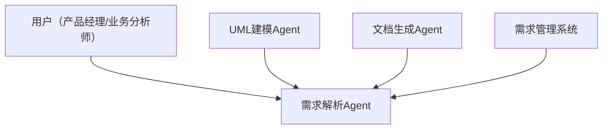
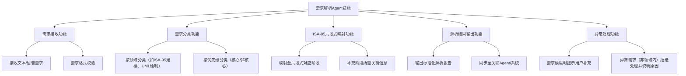
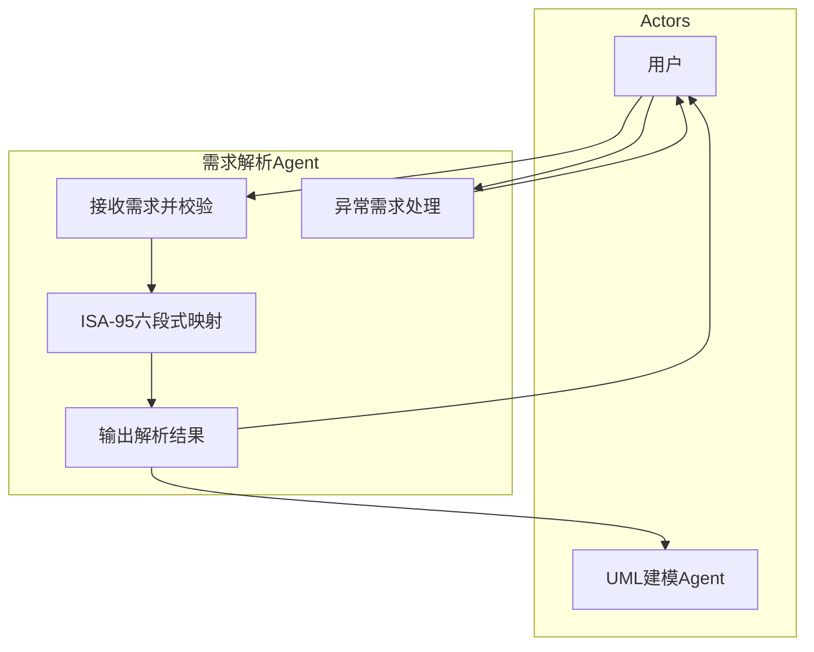
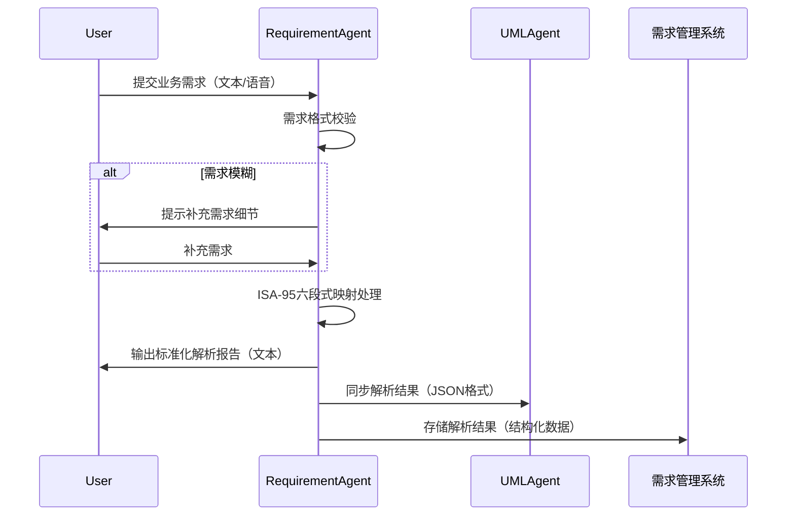
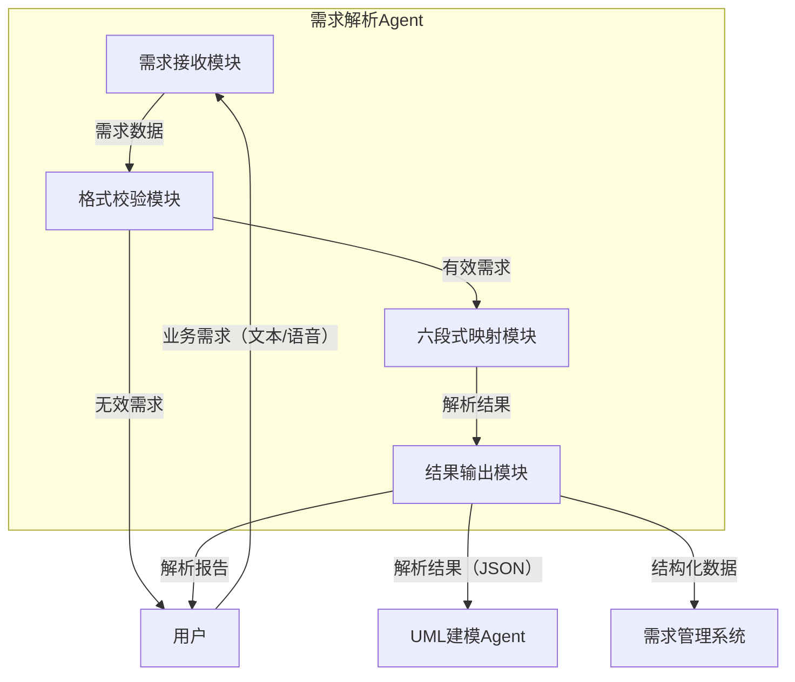
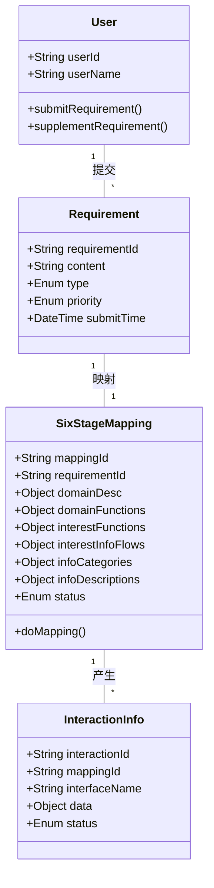
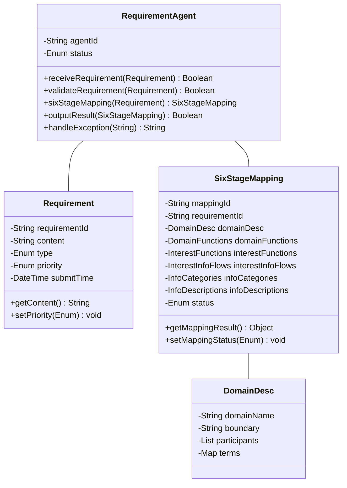
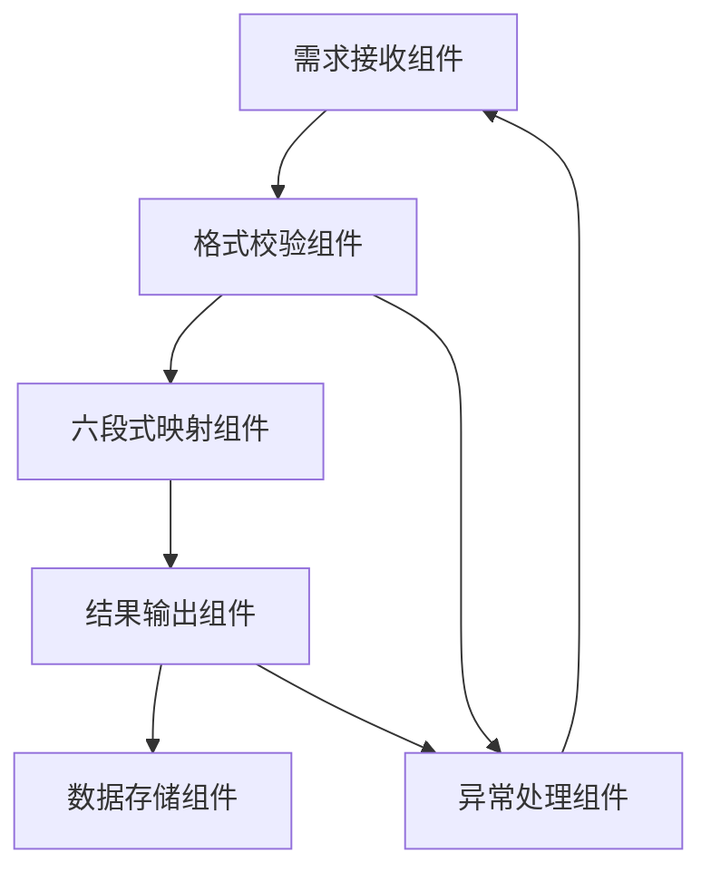

# Agent技能定义+需求文档+UML使用模板（ISA-95六段式融合版）

# 一、Agent Skill定义文档（ISA-95六段式规范）

文档目的：明确Agent技能的业务边界、核心能力、交互规则及落地标准，为Agent开发、测试、迭代提供标准化依据，适配软件工程UML建模流程，确保技能与业务需求一致。

适用范围：所有Agent技能（如需求解析Agent、UML建模Agent、文档生成Agent等），可根据具体技能类型灵活调整细节。

## 阶段1：Domain descriptions（领域描述）

### 1.1 技能领域边界

明确Agent技能所属的业务领域、核心服务范围，划定“技能能做什么/不能做什么”，用mermaid绘制系统上下文图（UML用例图简化版）。

示例（需求解析Agent）：

领域：企业级软件需求分析领域，聚焦ISA-95六段式建模相关需求解析，衔接业务需求与信息化表述。

边界：负责接收用户业务需求（如“ISA-95建模需求”“UML图绘制需求”），输出标准化需求解析结果；不负责需求落地开发、代码编写、硬件部署。

外部参与者：用户（产品经理/业务分析师）、UML建模Agent、文档生成Agent、需求管理系统。

### 1.2 领域术语表

|术语|定义|关联领域|
|---|---|---|
|ISA-95六段式|Domain descriptions→Functions in domains→Functions of interest→Information flows of interest→Categories of information→Information descriptions，业务需求到信息化的标准化转化流程|需求分析、信息化建模|
|UML图|软件工程中标准化的建模语言，含用例图、活动图、序列图等，用于可视化业务流程与软件设计|软件建模、需求可视化|
|信息流|核心功能/系统间流转的数据，含数据来源、去向、格式与频率|跨模块/系统交互|
## 阶段2：Functions in domains（领域内功能）

### 2.1 技能功能分解（WBS）

### 2.2 功能-能力映射表

|功能模块|核心子功能|对应业务能力|UML可视化方式|
|---|---|---|---|
|需求接收功能|文本/语音接收、格式校验|准确获取用户需求，过滤无效输入|用例图（细化参与者与用例）|
|ISA-95六段式映射功能|阶段映射、关键信息补充|将模糊需求转化为标准化六段式表述|活动图（映射流程）|
|异常处理功能|模糊需求提示、异常需求拒绝|提升需求解析的准确性与用户体验|状态机图（异常处理流程）|
## 阶段3：Functions of interest（关注的功能）

### 3.1 核心功能筛选（MVP）

结合技能核心目标，筛选必须实现的核心功能，排除非核心功能，用MoSCoW方法标注优先级。

|功能名称|优先级（MoSCoW）|是否核心功能|说明|
|---|---|---|---|
|需求接收与格式校验|Must have（必须有）|是|基础功能，确保需求有效输入|
|ISA-95六段式映射|Must have（必须有）|是|核心能力，实现需求标准化转化|
|解析结果输出|Must have（必须有）|是|核心输出，为后续流程提供依据|
|需求分类|Should have（应该有）|否|提升效率，非核心可后续迭代|
### 3.2 核心功能UML用例图（聚焦版）

## 阶段4：Information flows of interest（关注的信息流）

### 4.1 核心信息流梳理

明确核心功能间、Agent与外部参与者的信息流转，标注数据来源、去向、格式与频率，用mermaid绘制序列图与DFD图。

#### 4.1.1 序列图（核心交互时序）

#### 4.1.2 数据流图（DFD 1层）

### 4.2 接口交互清单

|接口名称|交互方向|数据格式|传输频率|核心字段|
|---|---|---|---|---|
|需求提交接口|用户→Agent|文本/语音|实时|需求内容、用户ID、需求类型|
|解析结果同步接口|Agent→UML建模Agent|JSON|实时|解析ID、六段式各阶段信息、需求优先级|
|结果存储接口|Agent→需求管理系统|结构化数据|实时|解析ID、用户ID、解析内容、创建时间|
## 阶段5：Categories of information（信息分类）

### 5.1 信息分类目录

|信息分类|核心实体|关联阶段|说明|
|---|---|---|---|
|需求类信息|用户需求、需求类型、需求优先级|阶段1-3|用户提交的原始需求及基础属性|
|解析类信息|六段式映射结果、解析报告、解析状态|阶段4-5|Agent处理后输出的标准化信息|
|交互类信息|接口数据、传输状态、异常信息|阶段4|Agent与外部参与者的交互数据|
### 5.2 数据字典（核心实体）

|实体名称|核心属性|数据类型|约束规则|语义说明|
|---|---|---|---|---|
|用户需求|需求ID、需求内容、用户ID、需求类型、提交时间|String、String、String、Enum、DateTime|需求内容非空，需求类型为{ISA-95建模、UML绘制、其他}|用户提交的原始业务需求|
|六段式映射结果|解析ID、需求ID、各阶段信息、映射状态|String、String、Object、Enum|解析ID唯一，映射状态为{成功、失败、待补充}|Agent将需求映射至ISA-95六段式的结果|
### 5.3 概念类图（UML）

## 阶段6：Information descriptions（信息描述）

### 6.1 设计类图（UML，可直接用于开发）

### 6.2 组件图（UML，Agent架构）

### 6.3 信息描述规范（落地标准）

1.  所有输出信息需符合JSON/文本标准格式，编码为UTF-8，无乱码；

2.  六段式映射结果需完整覆盖每个阶段，无遗漏，语义与领域术语表一致；

3.  接口数据字段需严格匹配接口交互清单，异常时需返回明确的错误码与说明；

4.  存储的结构化数据需与数据字典一致，支持后续查询、追溯与迭代。

# 二、需求文档模板（ISA-95六段式+UML融合版）

## 文档基本信息

|项目名称|需求名称|需求提出人|需求日期|优先级|迭代版本|
|---|---|---|---|---|---|
|__________|__________|__________|__________|□ 高 □ 中 □ 低|__________|
## 1. 需求背景与目标

1.1 需求背景：__________（说明需求产生的业务场景、痛点，如“现有Agent技能缺乏标准化定义，导致开发与业务需求脱节”）

1.2 需求目标：__________（明确需求要实现的核心价值，如“基于ISA-95六段式，定义Agent技能规范，实现业务需求到信息化的标准化转化”）

1.3 适用范围：__________（明确需求覆盖的场景、角色、系统，如“所有ISA-95建模相关Agent技能，适配产品经理、开发工程师”）

## 2. Domain descriptions（领域描述）

2.1 领域边界：__________（明确需求所属领域、核心范围，划定“做什么/不做什么”）

2.2 外部参与者：__________（列出需求相关的角色、系统、Agent）

2.3 领域术语表：（参考技能定义文档的术语表格式，补充需求相关术语）

2.4 UML系统上下文图：（插入mermaid代码，绘制系统上下文用例图）

## 3. Functions in domains（领域内功能）

3.1 功能分解树（WBS）：（插入mermaid代码，绘制功能分解图）

3.2 功能-能力映射表：（参考技能定义文档的映射表格式，补充需求相关功能）

3.3 UML可视化：（插入mermaid用例图、活动图，细化功能流程）

## 4. Functions of interest（关注的功能）

4.1 核心功能筛选：（用MoSCoW方法标注优先级，列出核心功能）

4.2 核心功能UML用例图：（插入mermaid聚焦版用例图，高亮核心用例）

4.3 非核心功能说明：（列出非核心功能，说明后续迭代计划）

## 5. Information flows of interest（关注的信息流）

5.1 核心信息流梳理：（说明信息流的来源、去向、格式、频率）

5.2 UML序列图：（插入mermaid序列图，可视化交互时序）

5.3 数据流图（DFD）：（插入mermaid DFD图，梳理数据流转）

5.4 接口交互清单：（参考技能定义文档的接口清单格式，补充需求相关接口）

## 6. Categories of information（信息分类）

6.1 信息分类目录：（参考技能定义文档的分类目录，补充需求相关信息分类）

6.2 数据字典：（列出核心实体的属性、数据类型、约束规则）

6.3 UML概念类图：（插入mermaid概念类图，抽象业务实体）

## 7. Information descriptions（信息描述）

7.1 UML设计类图：（插入mermaid设计类图，补充技术细节）

7.2 UML组件图/部署图：（插入mermaid组件图/部署图，明确架构）

7.3 信息描述规范：（明确信息输出格式、约束、落地标准）

7.4 数据库表结构（可选）：（列出核心表结构、主键/外键、索引）

## 8. 验收标准

8.1 功能验收：__________（明确每个核心功能的验收条件，如“六段式映射功能可准确将需求映射至对应阶段，无遗漏”）

8.2 性能验收：__________（明确性能要求，如“需求解析响应时间≤1s，准确率≥95%”）

8.3 接口验收：__________（明确接口交互要求，如“接口传输成功率≥99%，异常提示清晰”）

## 9. 风险与约束

9.1 风险：__________（列出需求落地过程中可能存在的风险，如“业务术语不统一，导致映射偏差”）

9.2 约束：__________（列出需求落地的约束条件，如“需适配现有UML工具，支持mermaid语法”）

## 10. 附录

10.1 参考文档：__________（列出需求参考的标准、文档，如“ISA-95标准、UML建模规范”）

10.2 补充说明：__________（其他需要补充的信息）

# 三、UML模板（什么时候用什么样的UML图，适配ISA-95六段式）

核心原则：UML图的使用需严格对应ISA-95六段式阶段，聚焦“业务建模→软件建模”的无缝衔接，每个阶段用对应的UML图实现可视化，避免过度建模。

## 1. 阶段1：Domain descriptions（领域描述）—— 定边界、统一语言

|UML图类型|使用时机|核心用途|mermaid模板|注意事项|
|---|---|---|---|---|
|系统上下文图（用例图简化版）|明确领域边界、外部参与者时|可视化系统与外部参与者的关系，划定业务范围|`graph TD
    A[参与者1] --> B[目标系统/Agent]
    C[参与者2] --> B
    D[参与者3] --> B
`|只标注核心参与者与核心交互，不细化内部功能|
|UML包图|划分领域模块、明确模块依赖时|按业务领域划分包，梳理包之间的依赖关系|`graph TB
    subgraph 领域包1
        C1[类1]
        C2[类2]
    end
    subgraph 领域包2
        C3[类3]
        C4[类4]
    end
    领域包1 --> 领域包2
`|包的划分需贴合业务领域，避免技术层面的拆分|
## 2. 阶段2：Functions in domains（领域内功能）—— 拆功能、分模块

|UML图类型|使用时机|核心用途|mermaid模板|注意事项|
|---|---|---|---|---|
|UML用例图（细化版）|拆解全量功能、梳理参与者与用例关系时|列出全量用例，标注用例间的包含/扩展/泛化关系|`graph TB
    subgraph Actors
        A1[参与者1]
        A2[参与者2]
    end
    subgraph 目标系统
        UC1[用例1]
        UC2[用例2]
        UC3[用例3]
    end
    A1 --> UC1
    A2 --> UC2
    UC1 --> UC3
`|覆盖领域内所有功能，不遗漏关键用例|
|UML活动图|梳理业务流程、决策分支时|可视化功能执行流程、并行/分支逻辑、泳道划分|`flowchart TD
    subgraph 角色1
        A1[开始] --> B1[动作1]
        B1 --> C1[动作2]
        C1 --> D1{决策}
        D1 --> E1[动作3]
        D1 --> F1[动作4]
    end
    subgraph 角色2
        E1 --> G2[动作5]
        F1 --> H2[动作6]
    end
`|标注决策点、异常分支，贴合实际业务流程|
|UML状态机图|梳理核心对象全生命周期状态时|可视化对象的状态流转、触发条件、异常状态|`stateDiagram-v2
    [*] --> 状态1
    状态1 --> 状态2 : 触发条件1
    状态1 --> 状态3 : 触发条件2
    状态2 --> 状态4 : 触发条件3
    状态3 --> 状态4 : 触发条件4
    状态4 --> [*] : 结束条件
`|只聚焦核心对象（如需求、工单），不细化次要对象|
## 3. 阶段3：Functions of interest（关注的功能）—— 抓核心、排优先级

|UML图类型|使用时机|核心用途|mermaid模板|注意事项|
|---|---|---|---|---|
|UML用例图（聚焦版）|筛选核心MVP功能、明确迭代范围时|高亮核心用例，隐藏非核心用例，明确MVP范围|`graph TB
    A[参与者]
    subgraph 目标系统
        UC1[核心用例1]
        UC2[核心用例2]
        UC3[非核心用例]
    end
    A --> UC1
    A --> UC2
`|用注释标注核心/非核心，明确优先级|
|用户故事地图|拆解核心用例、规划迭代计划时|按“用户活动→任务→故事”分层，排序优先级|`graph TD
    A[用户活动1] --> B[任务1]
    A --> C[任务2]
    B --> D[用户故事1（高优）]
    B --> E[用户故事2（中优）]
    C --> F[用户故事3（高优）]
`|聚焦核心用户活动，不拆分过多细节故事|
## 4. 阶段4：Information flows of interest（关注的信息流）—— 理交互、定接口

|UML图类型|使用时机|核心用途|mermaid模板|注意事项|
|---|---|---|---|---|
|UML序列图|梳理跨系统/模块交互时序时|可视化交互对象、消息类型、时序、数据内容|`sequenceDiagram
    participant A as 参与者1
    participant B as 参与者2
    participant C as 参与者3
    A->>B: 消息1（数据内容）
    B->>B: 内部处理
    alt 条件1
        B->>C: 消息2
        C->>B: 响应消息
    end
    B->>A: 结果反馈
`|标注消息格式、同步/异步，明确异常交互|
|数据流图（DFD）|梳理数据来源、处理、去向时|可视化数据流转路径，区分详细/非详细流|`graph TD
    subgraph 系统/模块
        A[处理模块1]
        B[处理模块2]
    end
    C[数据来源] -- 数据1 --> A
    A -- 数据2 --> B
    B -- 数据3 --> D[数据去向1]
    B -- 数据4 --> E[数据去向2]
`|实线标注详细流（标准覆盖），虚线标注非详细流（扩展）|
## 5. 阶段5：Categories of information（信息分类）—— 统标准、定语义

|UML图类型|使用时机|核心用途|mermaid模板|注意事项|
|---|---|---|---|---|
|UML概念类图|抽象业务实体、梳理实体关系时|定义核心实体、属性，标注实体间的关联/聚合/继承关系|`classDiagram
    class 实体1 {
        +属性1
        +属性2
    }
    class 实体2 {
        +属性3
        +属性4
    }
    class 实体3 {
        +属性5
    }
    实体1 "1" -- "*" 实体2 : 关联
    实体2 "1" -- "1" 实体3 : 聚合
`|不涉及技术细节（如方法、可见性），仅表达业务概念|
## 6. 阶段6：Information descriptions（信息描述）—— 做落地、建模型

|UML图类型|使用时机|核心用途|mermaid模板|注意事项|
|---|---|---|---|---|
|UML设计类图|转化为可开发的软件模型时|补充类的方法、可见性、接口、依赖，对应代码实现|`classDiagram
    class 类1 {
        -属性1: 类型
        +方法1(): 返回值
        +方法2(参数): 返回值
    }
    class 类2 {
        -属性2: 类型
        +方法3(): 返回值
    }
    class 接口1 {
        +方法4(): 返回值
    }
    类1 --> 类2 : 依赖
    类1 ..|> 接口1 : 实现
`|与代码实现一致，明确属性类型、方法参数与返回值|
|UML组件图|设计系统/Agent架构、组件依赖时|定义软件组件、组件间依赖、提供/依赖的接口|`graph TB
    C1[组件1]
    C2[组件2]
    C3[组件3]
    I1[接口1]
    I2[接口2]
    C1 --> C2
    C2 --> C3
    C1 --> I1
    C2 --> I2
`|组件划分贴合技术架构（如微服务、模块化）|
|UML部署图|设计硬件部署架构时|可视化服务器、数据库、设备等节点，及节点间通信|`graph TB
    subgraph 服务器1
        C1[组件1]
        C2[组件2]
    end
    subgraph 服务器2
        C3[组件3]
        DB[(数据库)]
    end
    subgraph 设备1
        C4[组件4]
    end
    服务器1 --> 服务器2
    服务器2 --> 设备1
`|标注节点类型、通信协议，适配实际部署场景|
## UML使用通用注意事项

1.  所有UML图需用mermaid语法编写，确保可直接渲染、可复用；

2.  每个UML图需对应ISA-95具体阶段，明确用途，避免图与阶段脱节；

3.  遵循“够用就好”原则，MVP阶段只绘制核心图，不做过度细化；

4.  语义统一，UML图中的实体、术语需与领域术语表、数据字典一致；

5.  可根据实际需求（如Agent类型、业务场景）灵活调整图的细节，不局限于模板。
> （注：文档部分内容可能由 AI 生成）